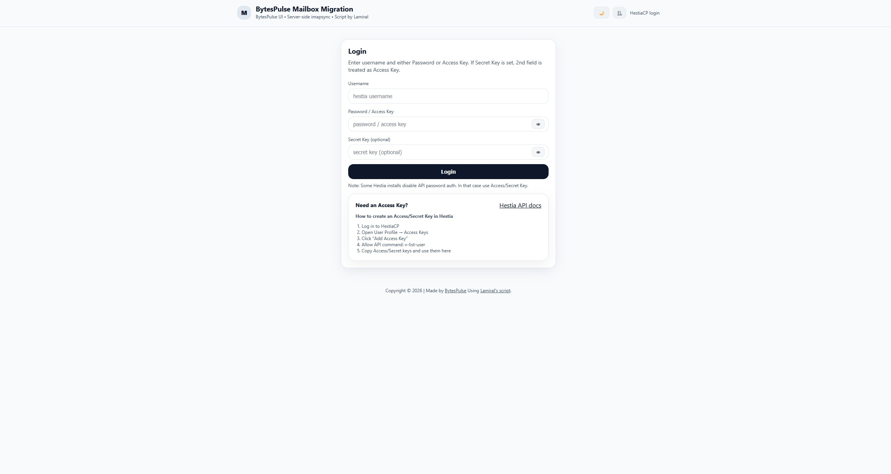
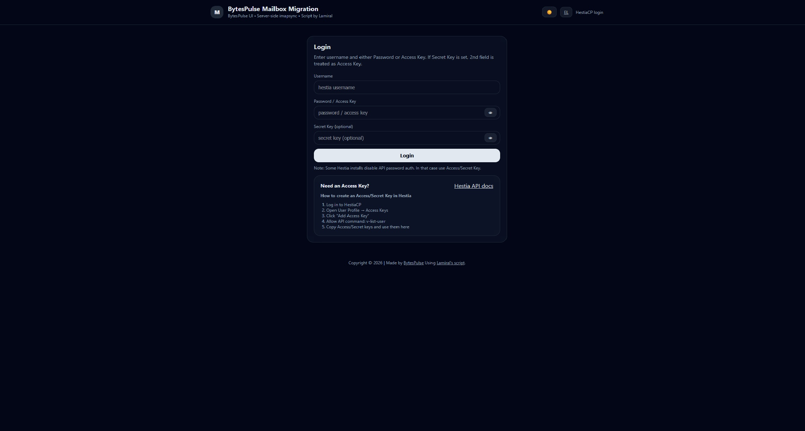
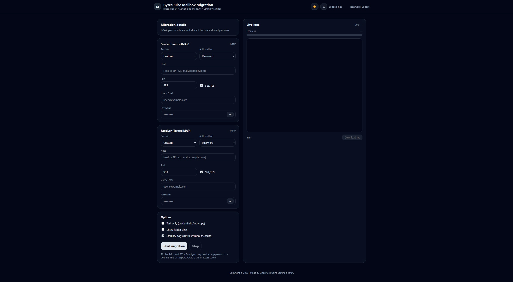

# IMAPSync Modern UI for HestiaCP (Ubuntu 24.04)

> **Installs on your server** and lets your **users/clients** run mailbox migrations from a modern Web UI, logging in with their **Hestia username + password** *or* **Access Key + Secret Key**.

🇬🇷 Ελληνικά παρακάτω • 🇬🇧 English below

---

## 🇬🇧 English

### What this is
A **single installer script** that sets up:

- **imapsync** (installed system-wide at `/usr/local/bin/imapsync`) from the included `imapsync` source file
- A modern, responsive **Web UI** deployed into a HestiaCP domain/subdomain `public_html`
- An **engine** directory placed **outside webroot** (config/lib/jobs)
- **Per-domain PHP-FPM user detection** (Hestia-style pools) and correct permissions for `jobs/`
- Dual login to the UI:
  - `username + password` *(works only if Hestia API allows password auth)*
  - `username + access key` + `secret key` *(recommended / works on all Hestia installs)*
- Language toggle **EN/EL**
- Provider presets + OAuth2 Access Token support (Gmail / Microsoft 365)

### Requirements
- Ubuntu 24.04
- HestiaCP installed
- You must have a **domain/subdomain already created in HestiaCP**
- You must run the installer as a user with **sudo** privileges
- Your repo contains:
  - `install_all.sh`
  - `imapsync`
  - `imapsync-ui-package.zip`

### One-line install
```bash
bash -c 'set -euo pipefail; REPO="https://raw.githubusercontent.com/BytesPulse-OE/ImapSync-With-UI/main"; DIR="/tmp/imapsync-ui-installer"; sudo mkdir -p "$DIR" && cd "$DIR"; sudo apt-get update -y >/dev/null; sudo apt-get install -y curl dos2unix unzip >/dev/null; sudo curl -fsSL "$REPO/install_imapsync.sh" -o install_imapsync.sh; sudo curl -fsSL "$REPO/imapsync" -o imapsync; sudo dos2unix -q install_imapsync.sh imapsync || true; sudo chmod +x install_imapsync.sh imapsync; ./install_imapsync.sh'
```

The installer will prompt:
- `Enter subdomain (e.g. imapsync.example.com):`

### What it installs
- imapsync → `/usr/local/bin/imapsync`
- UI → `/home/<hestia-user>/web/<domain>/public_html/`
  - includes **`/assets/`** (local CSS/JS) + `/api/`
- Engine → `/home/<hestia-user>/web/<domain>/imapsync-ui/engine/`
  - `engine/config/`
  - `engine/lib/`
  - `engine/jobs/` (writable by the detected PHP-FPM pool user)

### After install
Edit configuration if needed:
`/home/<hestia-user>/web/<domain>/imapsync-ui/engine/config/config.php`

Most common settings:
- `HESTIA_BASE_URL` (usually `https://127.0.0.1:8083`)
- `HESTIA_VERIFY_SSL` (`false` if self-signed)
- `ALLOW_ANY_HOST` (security policy)

---

## Important: enable `shell_exec` (PHP)
The UI runs `imapsync` on the server using PHP. For that, **PHP must allow** `shell_exec` (and typically `exec/proc_open/popen`).

### Where to change it
Depending on your setup, `disable_functions` can be set in:
1) **PHP-FPM pool** for the domain (Hestia per-domain pool), or  
2) Global **php.ini** for your PHP-FPM version.

### Fix in php.ini (example)
1) Edit the FPM php.ini (example):
- `/etc/php/8.4/fpm/php.ini`

2) Locate:
```ini
disable_functions = ...
```

3) Remove `shell_exec` from the list (and optionally `exec,proc_open,popen`), then restart:
```bash
sudo systemctl restart php8.4-fpm
```

> If Hestia sets `disable_functions` in the **pool file**, remove it there too. Pool files are typically in:  
> `/etc/php/<version>/fpm/pool.d/`

---

## Notes / Security
This tool runs `imapsync` on your server. If you expose it publicly:
- Consider restricting hosts (`ALLOW_ANY_HOST=false` + `ALLOWED_HOSTS`)
- Add WAF/Cloudflare, rate limiting, or IP allowlisting

---

### Screenshots




## 🇬🇷 Ελληνικά

### Τι είναι
Ένα **ενιαίο script εγκατάστασης** που στήνει το εργαλείο **στον server σου** και δίνει πρόσβαση στους **users/πελάτες** σου μέσω Web UI με:

- `username + password` *(μόνο αν το Hestia API επιτρέπει password auth)*
- ή `access key + secret key` *(προτεινόμενο / δουλεύει παντού)*

Και επιπλέον εγκαθιστά:

- **imapsync** (system-wide στο `/usr/local/bin/imapsync`) από το `imapsync` source που υπάρχει στο repo
- Deploy ενός μοντέρνου, responsive **Web UI** μέσα στο `public_html` του domain/subdomain στο HestiaCP
- Δημιουργία **engine** φακέλου **εκτός webroot** (config/lib/jobs)
- Αυτόματο εντοπισμό του **PHP-FPM pool user/group** (Hestia per-domain pools) και σωστά permissions για το `jobs/`
- Εναλλαγή γλώσσας **EN/EL**
- Presets + OAuth2 Access Token υποστήριξη για Gmail / Microsoft 365

### Προαπαιτούμενα
- Ubuntu 24.04
- Εγκατεστημένο HestiaCP
- Το domain/subdomain πρέπει να έχει **ήδη δημιουργηθεί** στο HestiaCP
- Χρειάζεται χρήστης με **sudo** δικαιώματα
- Το repo πρέπει να περιέχει:
  - `install_all.sh`
  - `imapsync`
  - `imapsync-ui-package.zip`

### Εγκατάσταση με 1 εντολή
```bash
bash -c 'set -euo pipefail; REPO="https://raw.githubusercontent.com/BytesPulse-OE/ImapSync-With-UI/main"; DIR="/tmp/imapsync-ui-installer"; sudo mkdir -p "$DIR" && cd "$DIR"; sudo apt-get update -y >/dev/null; sudo apt-get install -y curl dos2unix unzip >/dev/null; sudo curl -fsSL "$REPO/install_imapsync.sh" -o install_imapsync.sh; sudo curl -fsSL "$REPO/imapsync" -o imapsync; sudo dos2unix -q install_imapsync.sh imapsync || true; sudo chmod +x install_imapsync.sh imapsync; ./install_imapsync.sh'
```

Το script θα σε ρωτήσει:
- `Enter subdomain (e.g. imapsync.example.com):`

### Τι εγκαθιστά / που τα βάζει
- imapsync → `/usr/local/bin/imapsync`
- UI → `/home/<hestia-user>/web/<domain>/public_html/`
  - περιλαμβάνει **`/assets/`** (local CSS/JS) + `/api/`
- Engine → `/home/<hestia-user>/web/<domain>/imapsync-ui/engine/`
  - `engine/config/`
  - `engine/lib/`
  - `engine/jobs/` (writable από τον PHP-FPM pool user που εντοπίζει το script)

### Μετά την εγκατάσταση
Ρύθμισε (αν χρειάζεται):
`/home/<hestia-user>/web/<domain>/imapsync-ui/engine/config/config.php`

Συνήθεις ρυθμίσεις:
- `HESTIA_BASE_URL` (συνήθως `https://127.0.0.1:8083`)
- `HESTIA_VERIFY_SSL` (`false` αν self-signed)
- `ALLOW_ANY_HOST` (policy ασφάλειας)

---

## Σημαντικό: ενεργοποίησε το `shell_exec` (PHP)
Το UI τρέχει `imapsync` στον server μέσω PHP. Για να δουλέψει, πρέπει το PHP να επιτρέπει **`shell_exec`** (και συνήθως `exec/proc_open/popen`).

### Fix στο php.ini (παράδειγμα)
1) Άνοιξε:
- `/etc/php/8.4/fpm/php.ini`

2) Βρες:
```ini
disable_functions = ...
```

3) Αφαίρεσε το `shell_exec` (και αν χρειαστεί `exec,proc_open,popen`) και κάνε restart:
```bash
sudo systemctl restart php8.4-fpm
```

> Αν το Hestia βάζει `disable_functions` στο **pool file**, πρέπει να αφαιρεθεί κι από εκεί. Συνήθως είναι στο:  
> `/etc/php/<version>/fpm/pool.d/`

---

### Σημείωση ασφάλειας
Το εργαλείο τρέχει `imapsync` στον server. Αν το αφήσεις δημόσιο:
- βάλε περιορισμούς σε hosts (`ALLOW_ANY_HOST=false` + `ALLOWED_HOSTS`)
- βάλε WAF/Cloudflare, rate limit ή IP allowlist


### Στιγμιότυπα (Screenshots)


